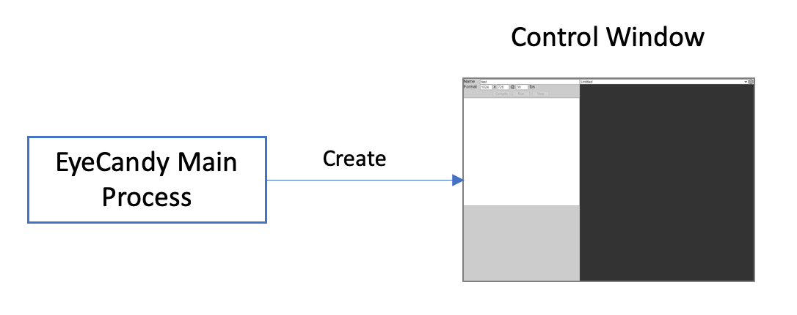
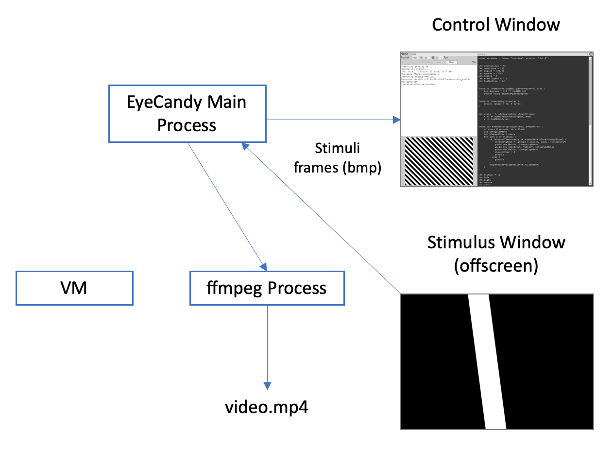
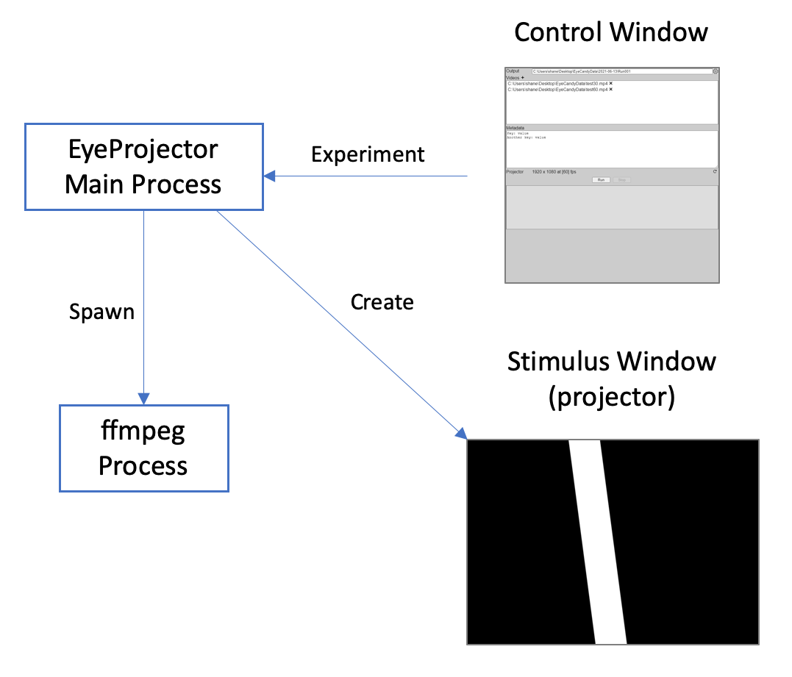

# Eye Candy

## EyeCandy program flow

**Step 1.** The main electron process creates the control window which allows the user to select an existing EyeCandy program or create a new one.

**Step 2.** A chain of events is kicked off when the user runs an EyeCandy program. First, the program text is passed back to the main process which spawns a new virtual machine and loads the program into it. The main process also spawns an instance of *ffmpeg* and creates the offscreen stimulus window.

**Step 3.** The EyeCandy program runs in the virtual machine and produces a series of JavaScript objects that describe the stimuli that need to be rendered. These objects are passed by the main process to the offscreen stimulus window.

**Step 4.** The offscreen stimulus window renders each stimulus object and the resulting frames are captured by the main process. Each frame is passed to *ffmpeg* for encoding and to the control window for display.

## EyeProjector program flow

**Step 1.** The main electron process creates the control window which allows the user to select the video files that will be played during the experiment.

**Step 2.** A chain of events is kicked off when the user runs the experiment. First, the description of the experiment is passed to the main process which spawns an instance of *ffmpeg* and create the stimulus window on the projector.

**Step 3.** The *ffmpeg* process decodes each video into a series of frames which are passed to the stimulus window for projection and the control window for preview.

