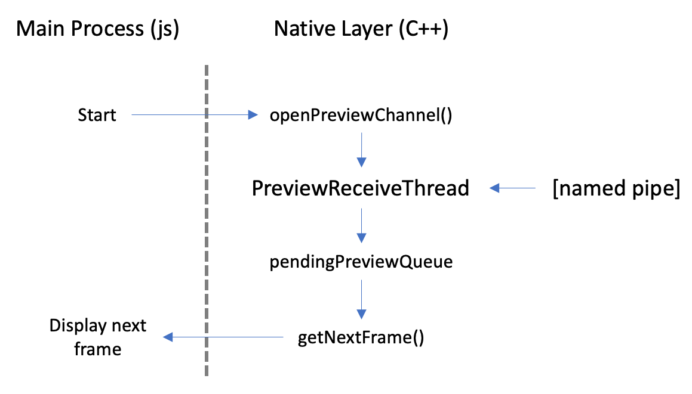
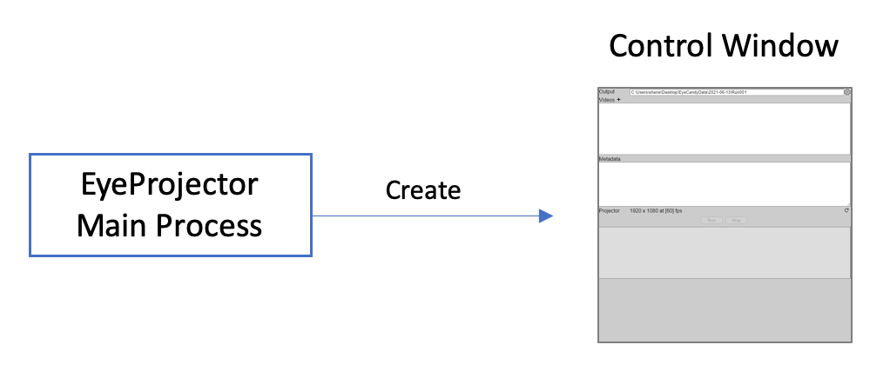
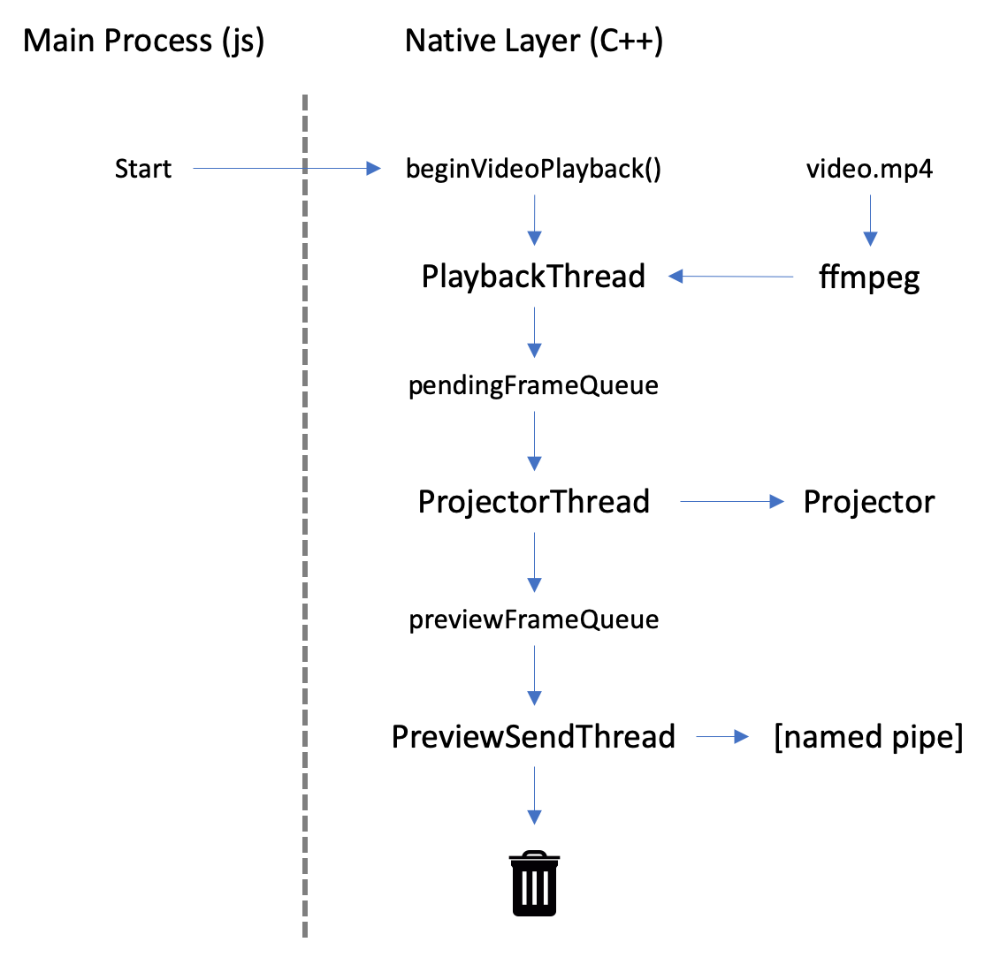

# Eye Candy

- [eye-native](eye-native/README.md)
- [eye-candy](eye-candy/README.md)
- [eye-projector](eye-projector/README.md)
- [eye-measure](eye-measure/README.md)

## EyeCandy program flow

**Step 1.** The main electron process creates the control window which allows the user to select an existing EyeCandy program or create a new one.

**Step 2.** A chain of events is kicked off when the user runs an EyeCandy program. First, the program text is passed back to the main process which spawns a new virtual machine and loads the program into it. The main process also spawns an instance of *ffmpeg* and creates the offscreen stimulus window.

**Step 3.** The EyeCandy program runs in the virtual machine and produces a series of JavaScript objects that describe the stimuli that need to be rendered. These objects are passed by the main process to the offscreen stimulus window.

**Step 4.** The offscreen stimulus window renders each stimulus object and the resulting frames are captured by the main process. Each frame is passed to *ffmpeg* for encoding and to the control window for display.

**Native integration.** The native C++ module is used to pass each frame to the *ffmpeg* process and optionally send a copy to the renderer process. Each frame that is captured by the main process is passed to the native layer by calling *queueNextFrame()*. A reference to the JavaScript object is retained in the *pendingFrames* array so the data remains valid until the native code has finished.

Frames are processed sequentially by the *RecordThread* and *PreviewSendThread*, with the former spawning an instance of *ffmpeg* and passing each frame to it as raw pixel data and the latter transmiting a copy of the frame to the renderer process via a named pipe if a connection has been established.

The control window has its own instance of the native code and uses it to receive frames from the main process via the named pipe. This approach is far more efficient than burdening the main process with the task of transferring the video data between the main and renderer processes.

## EyeProjector program flow

**Step 1.** The main electron process creates the control window which allows the user to select the video files that will be played during the experiment.

**Step 2.** A chain of events is kicked off when the user runs the experiment. First, the description of the experiment is passed to the main process which spawns an instance of *ffmpeg* and create the stimulus window on the projector.

**Step 3.** The *ffmpeg* process decodes each video into a series of frames which are passed to the stimulus window for projection and the control window for preview.

**Native integration.** The video decoding and playback pipeline exists in the native layer and is composed of the *PlaybackThread*, *ProjectorThread*, and *PreviewSendThread*.

The *PlaybackThread* handles spawning an *ffmpeg* process for each video in the list and capturing each frame as raw pixel data. It plays back the video as fast as it can but pauses when the *pendingFrameQueue* gets too full.

The *ProjectorThread* displays each frame on the projector at the desired frame rate and in sync with the vertical refresh signal. It should be the rate-limiting step in the pipeline.

Finally, the *PreviewSendThread* transmits a copy of the recently played frame to the control window for display to the user as described above.

